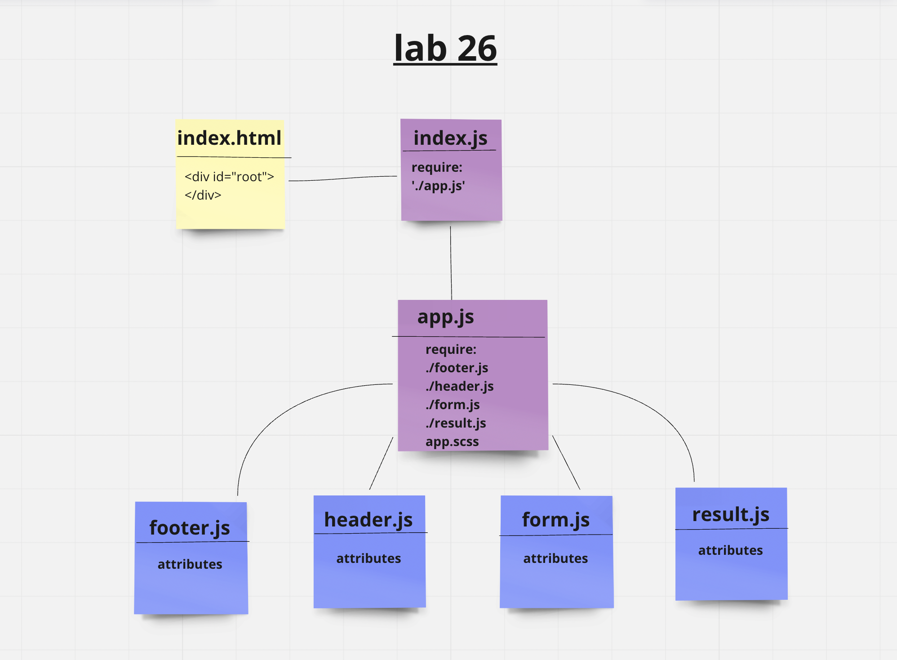
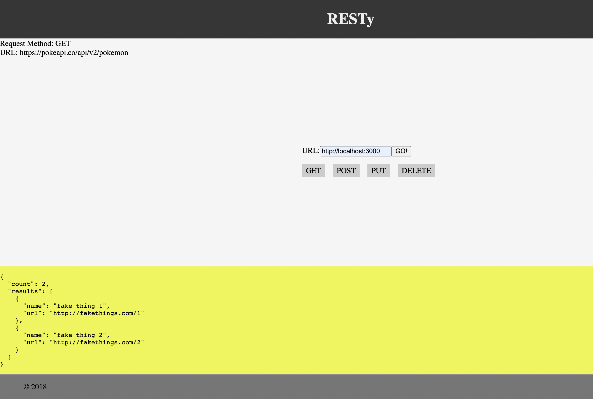

# resty

1. work on the RESTy API testing application
2. Retrieving User Input and Managing State

## Netlify link

[Netlify](https://saraaltayeh.github.io/resty/)

## UML diagram

## result from localhost

